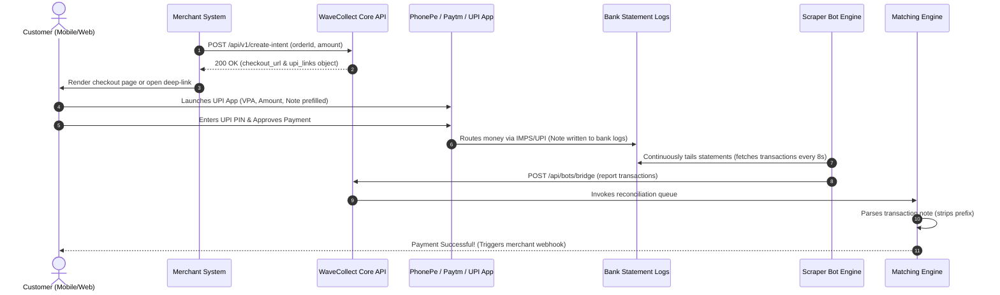

# WaveCollect UPI P2P Deep-Link & Intent Architecture Guide

This guide provides a comprehensive technical overview of WaveCollect's high-performance peer-to-peer (P2P) UPI routing, app-specific deep-linking, and real-time reconciliation systems. 

WaveCollect operates on a high-throughput, signature-free P2P scraper model. By bypassing commercial payment gateway (PG) restrictions and utilizing standard retail/personal bank transfers, WaveCollect ensures unmatched transaction stability, longevity of merchant sub-accounts (VPAs), and immediate automated settlement.

---

## 🗺️ Architectural Workflow

The diagram below details the end-to-end lifecycle of a P2P transaction, from merchant API request to automated bank log discovery:



---

---

## 1. 📸 Standard UPI QR Code Specifications (Scan Flow)

The QR code displayed on the desktop checkout interface is the primary payment vector for standard computer-to-mobile scanner flows. Standard UPI scanning engines (especially Google Pay, BHIM, and bank-specific apps) are extremely sensitive to URI structures and character encodings.

### 🚫 Bypassing Banking Firewalls (The "Barebones" Strategy)
Commercial payment links attach standard tracking parameters such as `tid` (Transaction ID) and `tr` (Transaction Reference). Scanning standard business links causes commercial gateways to evaluate and enforce retail account merchant limits.
*   **The WaveCollect Solution:** WaveCollect **completely strips `tid` and `tr`** from the QR code data URI. The only parameter carrying order identification is **`tn` (Transaction Note)**, formatting the transaction strictly as a personal P2P transfer!

### 🌐 Legacy Scanner Compatibility (Casing Rules)
Many cheap or older Android handsets running legacy scanning apps crash or throw exceptions when trying to parse complex URL-encoded strings. WaveCollect implements strict layout rules to maximize scanner success:
*   **Payee Address (`pa`):** The VPA domain must be left **completely raw and unencoded** (preserving the literal `@` sign, e.g., `pa=7440673279@okbizaxis`), preventing string-decoding glitches.
*   **Payee Name (`pn`):** Spaces inside the business/merchant name are explicitly mapped to **`+` symbols** instead of `%20` (e.g. `pn=SOLANA+TECHNOLOGIES`), as raw spaces or `%20` trigger "Security Violations" in legacy Google Pay scanners.

### 📋 Full QR Link URI Specification
```bash
upi://pay?pa={raw_vpa}&pn={plus_spaced_name}&am={amount}&cu=INR&tn={order_id}
```

#### Query Parameter Dictionary:
| Parameter | Purpose | Value & Type Enforced | Real-World Example |
| :--- | :--- | :--- | :--- |
| **`pa`** | Payee Address (VPA Domain) | Raw, unencoded string (trimmed, no `%40`) | `7440673279@okbizaxis` |
| **`pn`** | Payee Display Name | String with spaces mapped explicitly to `+` | `SOLANA+TECHNOLOGIES` |
| **`am`** | Transaction Amount | Float formatted to strictly **2 decimal places** | `1.75` |
| **`cu`** | Currency Code | Hardcoded to **`INR`** (NPCI mandate) | `INR` |
| **`tn`** | Transaction Note / Message | Clean 12-char alphanumeric order ID | `6FBOAptgW8Xe` |

---

## 2. 📲 PhonePe Native P2P Intent Specifications (Click Flow)

When a customer initiates checkout on a mobile device and chooses PhonePe, standard deep-links can trigger sluggish browser redirections or generic Android app-picker menus. WaveCollect bypasses this entirely using PhonePe's **native custom protocol**.

### 🔒 Secure Locked Checkout
The native PhonePe protocol accepts a **Base64-encoded JSON payload** representing the transfer context, which enforces a locked-down interface where customers cannot modify the amount or delete the reference note.

### 📋 Deep-Link URI format:
```bash
phonepe://native?data={base64_payload}&id=p2ppayment
```

### 📋 Decoded JSON Payload Schema:
```json
{
  "contact": {
    "cbsName": "",
    "nickName": "SOLANA TECHNOLOGIES",
    "vpa": "7440673279@okbizaxis",
    "type": "VPA"
  },
  "p2pPaymentCheckoutParams": {
    "note": "6FBOAptgW8Xe",
    "isByDefaultKnownContact": true,
    "enableSpeechToText": false,
    "allowAmountEdit": false,
    "showQrCodeOption": false,
    "disableViewHistory": true,
    "shouldShowUnsavedContactBanner": false,
    "isRecurring": false,
    "checkoutType": "DEFAULT",
    "transactionContext": "p2p",
    "initialAmount": 175,
    "disableNotesEdit": true,
    "showKeyboard": false,
    "currency": "INR",
    "shouldShowMaskedNumber": true
  }
}
```

#### JSON Payload Fields:
*   **`contact.nickName`:** The exact merchant business/brand name displayed to the customer inside the PhonePe UI.
*   **`contact.vpa`:** The raw target payee VPA domain.
*   **`p2pPaymentCheckoutParams.note`:** The exact 12-character alphanumeric order ID mapped directly to the locked note field.
*   **`p2pPaymentCheckoutParams.initialAmount`:** Denominated strictly in **paise** (calculated as `Math.round(amount * 100)`). E.g. `1.75 INR` translates to `175` paise.
*   **`p2pPaymentCheckoutParams.disableNotesEdit`:** Strictly set to `true` to guarantee the customer cannot alter the tracking note.
*   **`p2pPaymentCheckoutParams.allowAmountEdit`:** Strictly set to `false` to guarantee the customer pays the exact order value.

---

## 3. 💳 Paytm Cash Wallet P2P Intent Specifications (Click Flow)

For customers choosing Paytm on their mobile devices, WaveCollect utilizes a clean, lightweight P2P Cash Wallet scheme instead of Paytm's complex business merchant API. This eliminates the need for merchant keys and fragile digital signatures.

### ⚡ Bypassing Signature Restrictions
Standard Paytm commercial checkouts require secure merchant checkout tokens, checksums, and signatures that easily expire or trigger commercial limits. WaveCollect bypasses this entirely using the custom `paytmmp://cash_wallet` protocol configured with the `featuretype=money_transfer` P2P bypass flag.

### 📋 Deep-Link URI Format:
```bash
paytmmp://cash_wallet?pa={vpa}&pn={name}&am={amount}&cu=INR&tn={order_id}&featuretype=money_transfer
```

#### Query Parameter Dictionary:
| Parameter | Purpose | Value & Casing Enforced | Example |
| :--- | :--- | :--- | :--- |
| **`pa`** | Target Payee VPA | Raw, unencoded string (trimmed, no `%40`) | `7440673279@okbizaxis` |
| **`pn`** | Display Name | String with spaces mapped explicitly to `+` | `SOLANA+TECHNOLOGIES` |
| **`am`** | Transaction Amount | Float formatted to strictly **2 decimal places** | `1.75` |
| **`cu`** | Currency Code | Hardcoded to **`INR`** | `INR` |
| **`tn`** | Transaction Note | Clean 12-char alphanumeric order ID | `6FBOAptgW8Xe` |
| **`featuretype`** | P2P Bypass Flag | Hardcoded to **`money_transfer`** to route via cash wallet | `money_transfer` |

---

## 4. 🛡️ Real-Time Automated Reconciliation Flow

WaveCollect's core strength is its frictionless auto-matching engine. The system requires zero user upload of transaction receipts:

```
[Customer UPI App]  ──(Write Note)──>  [Bank Statement Log]
                                               │
                                       (Scrape Statement)
                                               ▼
[Database Intent Status: SUCCESS]  <──(Match Note)──  [Bot Scraper Bridge]
```

### Step 1: Note Injection
When the customer opens the deep link or scans the QR code, the transaction note parameter (`tn`) is parsed. The customer's UPI app automatically binds this note to the transfer record.

### Step 2: Statement Crawling
The scraper bot (running in the background) polls the sub-account's bank statement every 8 seconds. It downloads the ledger entries, parses each transaction, and extracts the reference field:
*   Standard scans will yield: `"Pay 6FBOAptgW8Xe"` or raw `"6FBOAptgW8Xe"`.

### Step 3: Atomic Reconciliation Queue
The bot posts the transaction ledger to `/api/bots/bridge`. The `MatchingEngine` executes an atomic database transaction:
1.  It trims whitespace and parses the note.
2.  It strips out any `"Pay "` prefix (case-insensitively).
3.  It queries the `paymentIntent` table for a record matching:
    *   `status: "PENDING"`
    *   `referenceId: "6FBOAptgW8Xe"`
    *   `amount: transactionAmount`
4.  Once matched, the order status transitions atomically to `SUCCESS`, immediately terminating checkout polling and dispatching an encrypted webhook notification back to the merchant!

---

## 5. 📂 Source Code Map

All deep-linking and intent routing components are situated inside the following key files:

*   **API Intent Generator:** [route.ts](file:///c:/CODE%20PROJECTS/WAVECOLLECT/wavecollect/src/app/api/v1/create-intent/route.ts) — Dynamic VPA lookup, PhonePe Base64 encoder, and Paytm intent generator returning the `"upi_links"` response block.
*   **Core DB Engine:** [PaymentEngine.ts](file:///c:/CODE%20PROJECTS/WAVECOLLECT/wavecollect/src/services/payment-engine/PaymentEngine.ts) — Base UPI deep-link assembler, pool allocator, and rate-limiting system.
*   **Static Checkout Route:** [route.ts](file:///c:/CODE%20PROJECTS/WAVECOLLECT/wavecollect/src/app/checkout/%5Btoken%5D/route.ts) — Static HTML server-rendered checkout launching the native intent bindings.
*   **Modern React Checkout Client:** [PaymentPageClient.tsx](file:///c:/CODE%20PROJECTS/WAVECOLLECT/wavecollect/src/app/pay/%5Btoken%5D/PaymentPageClient.tsx) — Responsive mobile UI rendering animated icons, QR data buffers, and direct-tap redirect links.
*   **Automated Match Engine:** [MatchingEngine.ts](file:///c:/CODE%20PROJECTS/WAVECOLLECT/wavecollect/src/services/matching/MatchingEngine.ts) — Scraped note sanitizer, database reconciliation processor, and transaction state supervisor.

---

> [!TIP]
> **Production Recommendation:** Keep `NEXT_PUBLIC_APP_URL` correctly configured in your `.env` file to ensure the base checkout links redirect flawlessly across all client integrations!
