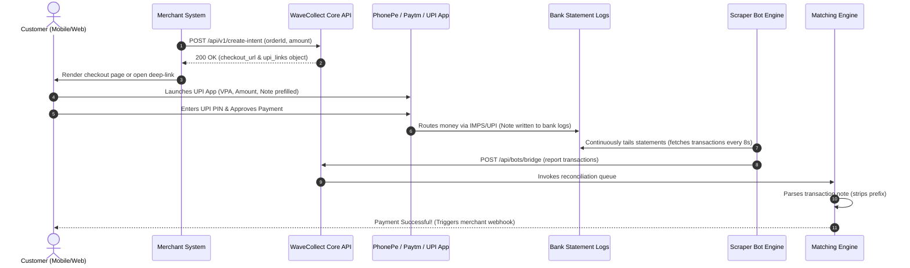

# WaveCollect UPI P2P Deep-Link & Intent Architecture Guide

This guide provides a comprehensive technical overview of WaveCollect's high-performance peer-to-peer (P2P) UPI routing, app-specific deep-linking, and real-time reconciliation systems. 

WaveCollect operates on a high-throughput, signature-free P2P scraper model. By bypassing commercial payment gateway (PG) restrictions and utilizing standard retail/personal bank transfers, WaveCollect ensures unmatched transaction stability, longevity of merchant sub-accounts (VPAs), and immediate automated settlement.

---

## 🗺️ Architectural Workflow

The diagram below details the end-to-end lifecycle of a P2P transaction, from merchant API request to automated bank log discovery:



---

## 1. 🔗 The UPI Deep-Link Formula (Maximum Scanning Parity)

Modern UPI scanning apps (such as Google Pay, PhonePe, Paytm, and BHIM) are highly sensitive to URI parameters. WaveCollect utilizes a strictly optimized **"Barebones" P2P Link Formula** that strips away all merchant tracking parameters to route transaction flows as standard friend-to-friend P2P payments.

### 🚫 Bypassing Banking Firewalls
Standard business checkouts include transaction parameters like `tid` (Transaction ID) and `tr` (Transaction Reference). When scanned, banking gateways run strict **Merchant Commercial Limit Validations** against these IDs. If a VPA is hosted on standard retail nodes, the transaction is instantly blocked.
*   **Solution:** WaveCollect **completely strips `tid` and `tr`** from all consumer QR codes and standard links, utilizing **strictly `tn` (Transaction Note)** to carry the unique order reference.

### 🌐 Legacy Scanner Compatibility & Casing Rule
To ensure older Android smartphones, legacy banking apps (e.g. SBI UPI, HDFC PayZapp), and desktop webcams scan QR codes successfully with a **100% success rate**, we implement custom URL format sanitization:
*   **VPA Casing (`pa`):** The payee VPA domain must remain **completely raw/unencoded** (using the literal `@` character, e.g. `pa=7440673279@okbizaxis`), preventing decoder crashes on older handsets.
*   **Name Casing (`pn`):** Spaces inside the business/merchant name are explicitly mapped to **`+` symbols** instead of standard percent-encoding `%20` (e.g. `pn=SOLANA+TECHNOLOGIES`), as older engines throw security exceptions on raw spaces or `%20`.

### 📋 Full UPI Link Specification
```bash
upi://pay?pa={raw_vpa}&pn={plus_spaced_name}&am={amount}&cu=INR&tn={order_id}
```

| Query Parameter | Purpose | Formatting Enforced | Example |
| :--- | :--- | :--- | :--- |
| **`pa`** | Payee Address (VPA Domain) | Trimmed & Raw (Unencoded `@` sign) | `7440673279@okbizaxis` |
| **`pn`** | Payee Display Name | Encoded, spaces mapped to `+` | `SOLANA+TECHNOLOGIES` |
| **`am`** | Transaction Amount | Decimal string, formatted to strictly 2 decimal places | `1.75` |
| **`cu`** | Currency Identifier | Strictly hardcoded to `INR` | `INR` |
| **`tn`** | Transaction Note / Description | Clean 12-character alphanumeric order ID | `6FBOAptgW8Xe` |

---

## 2. 📲 App-Specific P2P Redirect Intents

When customers complete transactions on their mobile devices, standard UPI intents can occasionally trigger app-picker menus. To streamline the user experience, WaveCollect generates direct, single-click application intents that bypass menus and launch PhonePe or Paytm immediately.

### A. PhonePe Native P2P Redirect (`phonepe://native`)
PhonePe enforces a highly secure, locked payment protocol. It expects a **Base64-encoded JSON payload** representing the transfer context:

```bash
phonepe://native?data={base64_payload}&id=p2ppayment
```

#### Decoded JSON Payload Structure:
```json
{
  "contact": {
    "cbsName": "",
    "nickName": "SOLANA TECHNOLOGIES",
    "vpa": "7440673279@okbizaxis",
    "type": "VPA"
  },
  "p2pPaymentCheckoutParams": {
    "note": "6FBOAptgW8Xe",
    "isByDefaultKnownContact": true,
    "enableSpeechToText": false,
    "allowAmountEdit": false,
    "showQrCodeOption": false,
    "disableViewHistory": true,
    "shouldShowUnsavedContactBanner": false,
    "isRecurring": false,
    "checkoutType": "DEFAULT",
    "transactionContext": "p2p",
    "initialAmount": 175,
    "disableNotesEdit": true,
    "showKeyboard": false,
    "currency": "INR",
    "shouldShowMaskedNumber": true
  }
}
```

> [!NOTE]
> *   **`initialAmount`** is denominated strictly in **paise** (e.g. `1.75 INR` translates to `175` paise).
> *   **`disableNotesEdit`** is locked to `true` and **`allowAmountEdit`** is locked to `false`, preventing customers from modifying payment details.

---

### B. Paytm Cash Wallet Redirect (`paytmmp://cash_wallet`)
Rather than utilizing Paytm's complex business merchant API (which requires digital signatures and commercial keys), WaveCollect routes Paytm transfers via a clean P2P Cash Wallet scheme utilizing the standard `featuretype=money_transfer` P2P bypass flag:

```bash
paytmmp://cash_wallet?pa={vpa}&pn={name}&am={amount}&cu=INR&tn={order_id}&featuretype=money_transfer
```

---

## 3. 🛡️ Real-Time Automated Reconciliation Flow

WaveCollect's core strength is its frictionless auto-matching engine. The system requires zero user upload of transaction receipts:

```
[Customer UPI App]  ──(Write Note)──>  [Bank Statement Log]
                                               │
                                       (Scrape Statement)
                                               ▼
[Database Intent Status: SUCCESS]  <──(Match Note)──  [Bot Scraper Bridge]
```

### Step 1: Note Injection
When the customer opens the deep link or scans the QR code, the transaction note parameter (`tn`) is parsed. The customer's UPI app automatically binds this note to the transfer record.

### Step 2: Statement Crawling
The scraper bot (running in the background) polls the sub-account's bank statement every 8 seconds. It downloads the ledger entries, parses each transaction, and extracts the reference field:
*   Standard scans will yield: `"Pay 6FBOAptgW8Xe"` or raw `"6FBOAptgW8Xe"`.

### Step 3: Atomic Reconciliation Queue
The bot posts the transaction ledger to `/api/bots/bridge`. The `MatchingEngine` executes an atomic database transaction:
1.  It trims whitespace and parses the note.
2.  It strips out any `"Pay "` prefix (case-insensitively).
3.  It queries the `paymentIntent` table for a record matching:
    *   `status: "PENDING"`
    *   `referenceId: "6FBOAptgW8Xe"`
    *   `amount: transactionAmount`
4.  Once matched, the order status transitions atomically to `SUCCESS`, immediately terminating checkout polling and dispatching an encrypted webhook notification back to the merchant!

---

## 📂 Source Code Map

All deep-linking and intent routing components are situated inside the following key files:

*   **API Intent Generator:** [route.ts](file:///c:/CODE%20PROJECTS/WAVECOLLECT/wavecollect/src/app/api/v1/create-intent/route.ts) — Dynamic VPA lookup, PhonePe Base64 encoder, and Paytm intent generator returning the `"upi_links"` response block.
*   **Core DB Engine:** [PaymentEngine.ts](file:///c:/CODE%20PROJECTS/WAVECOLLECT/wavecollect/src/services/payment-engine/PaymentEngine.ts) — Base UPI deep-link assembler, pool allocator, and rate-limiting system.
*   **Static Checkout Route:** [route.ts](file:///c:/CODE%20PROJECTS/WAVECOLLECT/wavecollect/src/app/checkout/%5Btoken%5D/route.ts) — Static HTML server-rendered checkout launching the native intent bindings.
*   **Modern React Checkout Client:** [PaymentPageClient.tsx](file:///c:/CODE%20PROJECTS/WAVECOLLECT/wavecollect/src/app/pay/%5Btoken%5D/PaymentPageClient.tsx) — Responsive mobile UI rendering animated icons, QR data buffers, and direct-tap redirect links.
*   **Automated Match Engine:** [MatchingEngine.ts](file:///c:/CODE%20PROJECTS/WAVECOLLECT/wavecollect/src/services/matching/MatchingEngine.ts) — Scraped note sanitizer, database reconciliation processor, and transaction state supervisor.

---

> [!TIP]
> **Production Recommendation:** Keep `NEXT_PUBLIC_APP_URL` correctly configured in your `.env` file to ensure the base checkout links redirect flawlessly across all client integrations!
